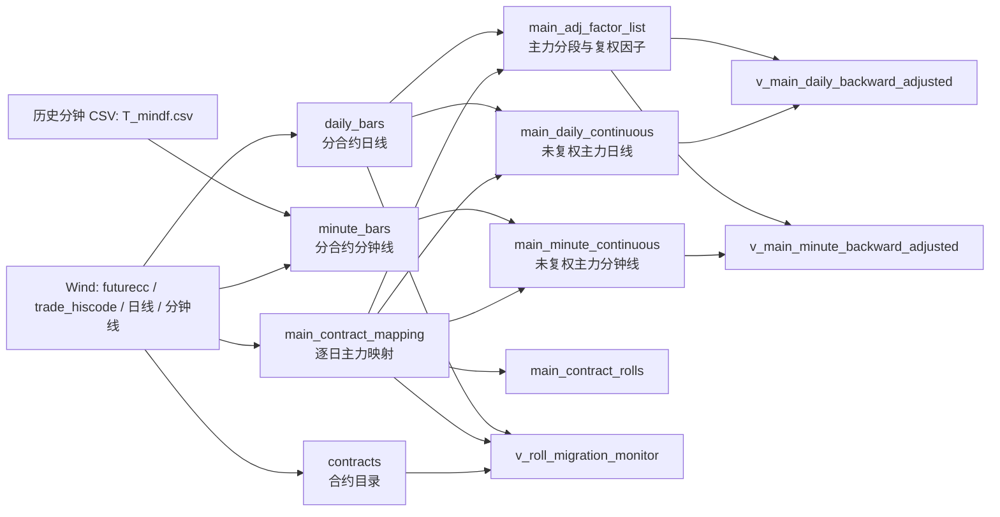

# `treasury_futures.duckdb` 数据库说明

本文档面向需要查询、维护或复用国债期货数据的研究同事，介绍数据库的用途、数据来源、表结构、关键口径和当前快照的已知注意事项。

> 快照说明：本文中的行数和覆盖范围来自 **2026-07-15 对数据库文件的只读检查**。数据库最新数据日为 **2026-07-14**；后续增量更新后，统计数字会发生变化。

## 1. 了解这个库

- 数据库文件：`data/database/treasury_futures.duckdb`
- 数据对象：中金所 T 品种（Wind 品种代码 `T.CFE`）的合约目录、主力映射、日线和分钟线
- 主要数据源：Wind；2019–2024 年的部分历史分钟线来自 `data/input/T_mindf.csv`
- 数据分层：合约参照数据 → 原始分合约行情 → 未复权主力连续行情 → 复权视图和移仓监控视图
- 当前文件大小：约 113.5 MiB（磁盘文件约 119 MB）
- 数据库版本：当前快照由 DuckDB 1.5.4 正常只读打开

如果只想快速选表：

| 需求 | 推荐对象 |
|---|---|
| 查询单个具体合约的日线 | `daily_bars` |
| 查询单个具体合约的分钟线 | `minute_bars` |
| 查询逐日主力合约代码 | `main_contract_mapping` |
| 研究未复权主力日线 | `main_daily_continuous` |
| 研究未复权主力分钟线 | `main_minute_continuous` |
| 研究后复权主力日线 | `v_main_daily_backward_adjusted` |
| 研究后复权主力分钟线 | `v_main_minute_backward_adjusted`，但请先阅读第 7 节的覆盖差异 |
| 判断移仓阶段或是否屏蔽信号 | `v_roll_migration_monitor` |
| 查看历次主力切换日 | `main_contract_rolls` |

## 2. 数据流与对象关系



数据库没有声明外键，表之间通过业务键建立逻辑关系：

- `contracts.wind_code` ↔ 各行情表的 `wind_code` / `main_contract`
- `main_contract_mapping.trade_date` ↔ 连续行情表的 `trade_date`
- `daily_bars.(wind_code, trade_date)` ↔ 某日某合约的日行情
- `minute_bars.(wind_code, bar_time)` ↔ 某分钟某合约的分钟行情
- `main_adj_factor_list` 通过 `main_contract` 和日期区间连接连续行情

## 3. 当前快照概览

### 3.1 物理表

| 表名 | 粒度 / 主键 | 行数 | 当前覆盖范围 |
|---|---|---:|---|
| `contracts` | 每合约一行；PK `wind_code` | 47 | 交割月 201509–202703 |
| `main_contract_mapping` | 每交易日一行；PK `trade_date` | 2,682 | 2015-06-30–2026-07-14 |
| `daily_bars` | 每合约、每交易日一行；PK `(wind_code, trade_date)` | 8,046 | 2015-06-30–2026-07-14，47 个合约 |
| `minute_bars` | 每合约、每分钟一行；PK `(wind_code, bar_time)` | 622,838 | 2019-01-02 09:15–2026-07-14 15:03，33 个合约 |
| `main_daily_continuous` | 每交易日一行；PK `trade_date` | 2,682 | 2015-06-30–2026-07-14 |
| `main_minute_continuous` | 每分钟一行；PK `bar_time` | 472,794 | 2019-01-02 09:15–2026-07-14 15:02 |
| `main_adj_factor_list` | 每个连续主力区间一行；PK `segment_start` | 45 | 2015-06-30–2026-07-14 |

### 3.2 视图

| 视图名 | 用途 | 当前行数 / 覆盖范围 |
|---|---|---|
| `main_contract_rolls` | 主力合约首次出现及后续切换日 | 45 行；最后一次切换日为 2026-05-27 |
| `v_main_daily_backward_adjusted` | 按结算价换月比例生成的后复权主力日线 | 2,682 行；2015-06-30–2026-07-14 |
| `v_main_minute_backward_adjusted` | 同一复权因子作用于主力分钟 OHLC | 466,633 行；2019-01-02–2026-07-14 |
| `v_roll_migration_monitor` | 主力与后 3 个月合约之间的移仓状态和信号屏蔽标志 | 2,682 行；2015-06-30–2026-07-14 |

物理表保存数据；视图不重复保存数据，查询结果会随底层表变化。

## 4. 通用字段口径

| 字段 | 含义 |
|---|---|
| `trade_date` | 交易日，DuckDB 类型为 `DATE` |
| `bar_time` | 一分钟 bar 的起始时间；无时区信息，按交易所本地时间理解 |
| `begin_time` / `end_time` | 当前实现分别等于 `bar_time` 和 `bar_time + 59 秒` |
| `wind_code` | 具体合约 Wind 代码，例如 `T2609.CFE` |
| `main_contract` | 当日或该分钟所属的主力合约代码 |
| `open/high/low/close` | 开、高、低、收价格 |
| `settle` | 日结算价；分钟表没有该字段 |
| `volume` | 成交量，保留数据源的期货成交量口径 |
| `amt` | 成交额，库内统一为“元”口径；历史 CSV 的 `total_turnover` 原为万元，导入时乘以 10,000 |
| `oi` | 持仓量（open interest） |
| `oi_chg` | 日持仓量变化；仅日线表包含 |
| `data_source` | 分钟数据来源：`wind` 或 `historical_csv` |
| `ingested_at` | 原始行情写入数据库的时间 |
| `built_at` | 连续行情重建时间 |
| `updated_at` | 合约目录或主力映射刷新时间 |

## 5. 物理表数据字典

### 5.1 `contracts`：合约目录

一行代表一个具体 T 合约，是合约代码、交割月和到期信息的参照表。

| 字段 | 类型 | 说明 |
|---|---|---|
| `sec_name` | `VARCHAR` | 合约名称 |
| `code` | `VARCHAR` | Wind 返回的合约代码字段 |
| `wind_code` | `VARCHAR` | 标准 Wind 合约代码，主键 |
| `delivery_month` | `VARCHAR` | 交割月，格式 `YYYYMM` |
| `change_limit` | `DOUBLE` | 涨跌停幅度 |
| `target_margin` | `DOUBLE` | 目标保证金比例 |
| `contract_issue_date` | `DATE` | 合约上市/发行日期 |
| `last_trade_date` | `DATE` | 最后交易日 |
| `last_delivery_month` | `DATE` | 最后交割月对应日期字段 |
| `updated_at` | `TIMESTAMP` | 目录刷新时间 |

### 5.2 `main_contract_mapping`：逐日主力映射

数据来自 Wind `T.CFE` 的 `trade_hiscode`。它回答“某个交易日的主力合约是谁”，也是构建连续行情的核心驱动表。

| 字段 | 类型 | 说明 |
|---|---|---|
| `trade_date` | `DATE` | 交易日，主键 |
| `main_contract` | `VARCHAR` | 当日主力合约 Wind 代码 |
| `updated_at` | `TIMESTAMP` | 映射刷新时间 |

### 5.3 `daily_bars`：分合约原始日线

一行代表一个具体合约在一个交易日的行情。主键为 `(wind_code, trade_date)`，重复执行全量或增量更新不会产生重复主键。

字段包括：

- 标识：`trade_date`、`wind_code`
- 价格：`open`、`high`、`low`、`close`、`settle`
- 量额与持仓：`volume`、`amt`、`oi`、`oi_chg`
- 审计：`ingested_at`

该表包含主力和非主力合约，适合研究跨合约价差、换月和移仓。只需要主力序列时，应优先使用连续表。

### 5.4 `minute_bars`：分合约原始分钟线

一行代表一个具体合约的一分钟行情，主键为 `(wind_code, bar_time)`。

| 字段组 | 字段 |
|---|---|
| 日期时间 | `trade_date`、`bar_time`、`begin_time`、`end_time` |
| 合约 | `wind_code` |
| 行情 | `open`、`high`、`low`、`close`、`volume`、`amt`、`oi` |
| 来源与审计 | `data_source`、`ingested_at` |

当前来源分布：

| `data_source` | 行数 | 交易日数 | 覆盖 |
|---|---:|---:|---|
| `historical_csv` | 371,053 | 1,428 | 2019-01-02–2024-11-21 |
| `wind` | 251,785 | 504 | 2024-06-17–2026-07-14 |

两种来源在部分日期重叠。构建主力连续分钟线时，同一个 `bar_time` 优先保留 Wind 数据。

### 5.5 `main_daily_continuous`：未复权主力连续日线

由 `main_contract_mapping` 与 `daily_bars` 按 `(trade_date, main_contract)` 连接得到。每个交易日只保留当日主力合约行情。

字段为 `trade_date`、`main_contract`、日线 OHLC、`settle`、`volume`、`amt`、`oi`、`oi_chg` 和 `built_at`。

这是**未复权**序列，换月时可能出现由合约切换造成的价格跳空。计算跨换月收益时，应根据研究目的选择复权视图或自行处理换月。

### 5.6 `main_minute_continuous`：未复权主力连续分钟线

数据来自两条路径：

1. Wind 分钟线：按 `main_contract_mapping` 选择当日主力合约；
2. 历史 CSV：CSV 本身是历史主力分钟序列，直接进入候选集。

同一 `bar_time` 的优先级为 `wind` 高于 `historical_csv`。主键只有 `bar_time`，隐含假设是任一时刻只存在一个主力连续 bar。

当前连续分钟来源分布：

| `data_source` | 行数 | 交易日数 | 覆盖 |
|---|---:|---:|---|
| `historical_csv` | 371,053 | 1,428 | 2019-01-02–2024-11-21 |
| `wind` | 101,741 | 397 | 2024-11-22–2026-07-14 |

### 5.7 `main_adj_factor_list`：主力区间与复权因子

主力映射每发生一次合约变化，就形成一个新的连续区间。该表保存各区间的换月结算价以及乘法后复权因子。

| 字段 | 说明 |
|---|---|
| `segment_start` / `segment_end` | 当前主力合约区间的首尾交易日 |
| `main_contract` | 当前区间的主力合约 |
| `next_contract` | 下一个主力合约；最后一段为空 |
| `roll_date` | 下一个区间的开始日，即换月日 |
| `settle_reference_date` | 新旧合约都有有效结算价的最近参考日 |
| `old_settle` / `new_settle` | 参考日的新旧合约结算价 |
| `roll_gap` | `new_settle - old_settle` |
| `roll_ratio` | `new_settle / old_settle` |
| `backward_adj_factor` | 应乘到当前区间 OHLC 上的后复权因子 |
| `created_at` | 因子表重算时间 |

本项目的“后复权”定义为：最早区间因子固定为 1，此后每次换月累乘 `old_settle / new_settle`。视图只调整价格 OHLC（以及日线 `settle`），不调整成交量、成交额和持仓量，也不会改写未复权物理表。

## 6. 视图说明

### 6.1 `main_contract_rolls`

从 `main_contract_mapping` 计算：第一条主力记录以及主力代码相对前一交易日发生变化的日期都会出现在该视图中。

字段只有：

- `roll_date`：主力首次出现或切换日；
- `main_contract`：切换后的主力合约。

### 6.2 后复权视图

`v_main_daily_backward_adjusted` 和 `v_main_minute_backward_adjusted` 将连续行情与 `main_adj_factor_list` 按以下条件连接：

```sql
c.main_contract = f.main_contract
AND c.trade_date BETWEEN f.segment_start AND f.segment_end
```

输出包含 `backward_adj_factor`，价格字段已经乘过该因子。`volume`、`amt`、`oi` 等非价格字段保持原值。

### 6.3 `v_roll_migration_monitor`

该视图比较当日主力合约与“主力交割月 + 3 个月”的连一合约，用于识别成交量和持仓量是否正在向下一合约迁移。

关键指标：

| 字段 | 含义 |
|---|---|
| `next_volume_share_pct` | 连一成交量 / 主力与连一成交量合计，百分比 |
| `next_oi_share_pct` | 连一持仓量 / 主力与连一持仓量合计，百分比 |
| `migration_share_pct` | 上述两个占比中的较大值 |
| `paired_oi_transfer` | 主力减仓且连一增仓时，两者变化量绝对值的较小者 |
| `paired_oi_transfer_share_pct` | 配对移仓量相对主力前一口径持仓的比例 |
| `is_mapping_switch_day` | 主力映射是否在当日切换 |
| `data_complete` | 主力和连一的成交量、持仓量是否齐全 |
| `roll_status` | 移仓状态分类 |
| `block_signal` | 是否建议屏蔽当日收盘后产生、下一交易日执行的信号 |

状态判定有优先级：

1. 数据不完整：`DATA_INCOMPLETE`
2. 主力切换日：`SWITCH_DAY`
3. `migration_share_pct >= 50`：`CROSSOVER`
4. `migration_share_pct >= 25`：`ACTIVE`
5. `migration_share_pct >= 15`：`WATCH`
6. 其他：`NORMAL`

当数据不完整、主力发生切换，或迁移占比达到 25% 时，`block_signal = TRUE`。因此 `WATCH` 只预警，不直接屏蔽信号。

## 7. 当前快照的数据质量与使用注意事项

以下结论是对 2026-07-14 数据快照的检查结果，不应被理解为永久不变的数据库属性。

### 7.1 最新日线尚不完整

`main_daily_continuous` 的 2026-07-14 行中，`open/high/low/volume/amt/oi_chg` 为空，但 `close/settle/oi` 已有值。用于日频研究前，应刷新数据或明确剔除不完整交易日。

`daily_bars` 共 237 行至少缺一个核心字段：其中 234 行缺 `open/high/low`，另有 3 行（均为 2026-07-14）同时缺 `open/high/low/volume/amt/oi_chg`。非主力辅助合约可能存在部分字段为空，不能假设原始日线每一行都完整。

### 7.2 后复权分钟视图少于未复权连续表

`main_minute_continuous` 有 472,794 行，而 `v_main_minute_backward_adjusted` 有 466,633 行，相差 **6,161 行**。这些行全部来自 `historical_csv`，集中在部分历史换月附近；当 CSV 标记的 `main_contract` 与 Wind 主力分段不一致时，无法满足复权视图的内连接条件，因此不会出现在视图中。

如果策略要求逐分钟完整保留原始历史，请使用 `main_minute_continuous`，并先验证自定义复权方式；不要默认复权视图与未复权表行数相等。

### 7.3 早期 CSV 包含 09:15–09:29 数据

当前代码向 Wind 请求的日盘时段为 09:30–11:30、13:00–15:15，但历史 CSV 在 2019-01-02–2020-07-17 期间包含 5,595 行 09:15–09:29 的数据。做固定交易时段研究时，应显式设置时间过滤条件，而不是仅依赖数据库已有记录。

### 7.4 分钟表完整性

当前 `minute_bars` 和 `main_minute_continuous` 的 OHLC、`volume`、`amt`、`oi`、起止时间、来源字段和审计时间均无空值；各物理表主键检查未发现重复。

### 7.5 移仓监控的最新日

`v_roll_migration_monitor` 在当前快照中有 1 个 `DATA_INCOMPLETE` 交易日，即 2026-07-14；其 `block_signal = TRUE`。研究代码应优先使用视图给出的 `data_complete` 和 `block_signal`，不要只看迁移比例。

## 8. 查询示例

### 8.1 Python 只读连接

从项目根目录启动 Python 或 Jupyter：

```python
import duckdb

from treasury_futures.paths import DB_PATH

with duckdb.connect(str(DB_PATH), read_only=True) as con:
    latest_daily = con.execute(
        """
        SELECT trade_date, main_contract, close, settle, volume, oi
        FROM main_daily_continuous
        WHERE close IS NOT NULL
        ORDER BY trade_date DESC
        LIMIT 20
        """
    ).fetchdf()
```

如果尚未安装本项目包，可先在项目根目录执行：

```powershell
python -m pip install -e .
```

也可以直接传入数据库文件的绝对路径，但共享代码中优先使用 `treasury_futures.paths.DB_PATH`，避免路径在 Notebook 之间漂移。

### 8.2 查询某个具体合约的日线

```sql
SELECT trade_date, open, high, low, close, settle, volume, amt, oi
FROM daily_bars
WHERE wind_code = 'T2609.CFE'
  AND trade_date BETWEEN DATE '2026-06-01' AND DATE '2026-07-13'
ORDER BY trade_date;
```

### 8.3 查询主力后复权日线

```sql
SELECT trade_date, main_contract, backward_adj_factor,
       open, high, low, close, settle, volume, oi
FROM v_main_daily_backward_adjusted
WHERE trade_date BETWEEN DATE '2025-01-01' AND DATE '2026-06-30'
ORDER BY trade_date;
```

### 8.4 查询指定交易时段的主力分钟线

```sql
SELECT trade_date, bar_time, main_contract,
       open, high, low, close, volume, amt, oi, data_source
FROM main_minute_continuous
WHERE trade_date = DATE '2026-07-13'
  AND CAST(bar_time AS TIME) BETWEEN TIME '14:30:00' AND TIME '15:15:00'
ORDER BY bar_time;
```

### 8.5 查询需要屏蔽信号的交易日

```sql
SELECT trade_date, main_contract, next_contract,
       roll_status, migration_share_pct, data_complete, block_signal
FROM v_roll_migration_monitor
WHERE block_signal
ORDER BY trade_date DESC;
```

### 8.6 检查各表最新数据时间

```sql
SELECT 'daily_bars' AS object_name,
       min(trade_date)::VARCHAR AS min_time,
       max(trade_date)::VARCHAR AS max_time,
       count(*) AS row_count
FROM daily_bars
UNION ALL
SELECT 'minute_bars', min(bar_time)::VARCHAR, max(bar_time)::VARCHAR, count(*)
FROM minute_bars
UNION ALL
SELECT 'main_daily_continuous', min(trade_date)::VARCHAR, max(trade_date)::VARCHAR, count(*)
FROM main_daily_continuous
UNION ALL
SELECT 'main_minute_continuous', min(bar_time)::VARCHAR, max(bar_time)::VARCHAR, count(*)
FROM main_minute_continuous;
```

### 8.7 检查复权分钟覆盖差异

```sql
SELECT
    (SELECT count(*) FROM main_minute_continuous) AS continuous_rows,
    (SELECT count(*) FROM v_main_minute_backward_adjusted) AS adjusted_rows;
```

## 9. 更新与维护

### 9.1 日常增量更新

入口 Notebook：`notebooks/data_pipeline/01_TreasuryFutures.ipynb`

1. 从项目根目录启动 Jupyter；
2. 在 Notebook 中将 `RUN_INCREMENTAL_UPDATE = True`；
3. 运行增量更新单元；
4. 流程会刷新近期合约目录和主力映射、增量抓取日线和分钟线、重建连续表，并重算复权因子及复权视图；
5. 检查各函数返回的更新摘要和最后几行数据；
6. 完成后执行 `con.close()`，释放数据库连接。

WindPy 由 Wind 终端环境提供，不在 `pyproject.toml` 中安装。首次建库和历史 CSV 导入流程也保存在同一个 Notebook 中，但不应在日常更新时随意打开 `RUN_FULL_UPDATE`。

### 9.2 刷新移仓监控视图

入口 Notebook：`factors/cicc_close_session_reverse/notebooks/02_Roll_Migration_Monitor.ipynb`

该 Notebook 使用 `factors/cicc_close_session_reverse/sql/roll_migration_monitor.sql` 创建或刷新 `v_roll_migration_monitor`。如果研究代码提示该视图不存在，应先运行此 Notebook。

### 9.3 并发和连接注意事项

- 分析查询默认使用 `read_only=True`；
- 不要让多个 Notebook/进程同时持有写连接；
- 更新完成后及时 `close()`，尤其是在运行移仓监控或因子构建之前；
- 更新流程包含事务和主键幂等写入，但仍应先检查 Wind 连接和返回摘要；
- 不建议在数据库外直接手工修改派生表。连续行情和复权因子应由数据管线重建，以保持口径一致。

当数据库结构、来源优先级、复权定义或移仓阈值发生变化时，应同步更新本文档。
